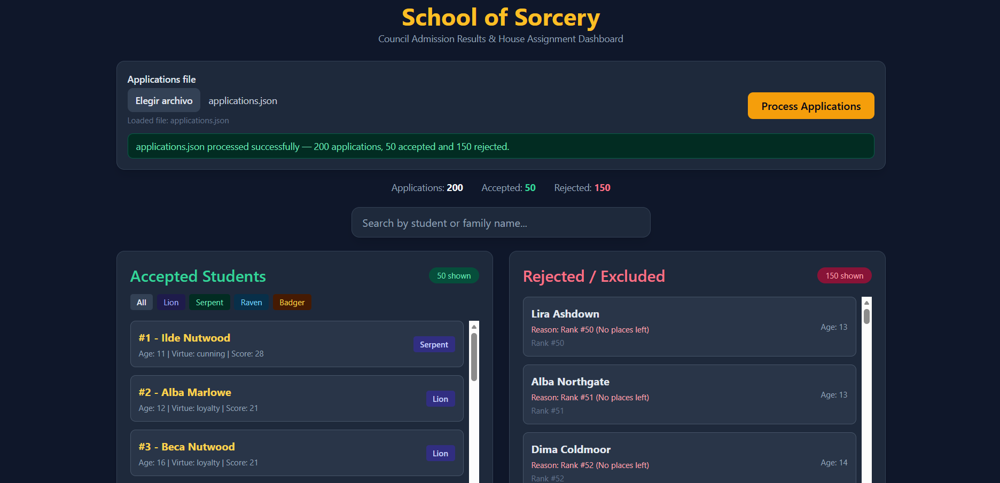

# School of Sorcery

Java application for processing student applications to the School of Sorcery.

The program reads:

- `data/applications.json`
- `data/council-rules.json`

It applies the council rules, calculates admission scores, ranks eligible applicants, handles invitations and vetoes, assigns houses, and produces the final admission results.

The application also includes a simple web interface where the council can upload a different applications JSON file and view the processed results.

## Dashboard



## Main Features

- Reads all yearly rules from `council-rules.json`
- Processes student applications from JSON
- Applies vetoes in the required order
- Invitations override vetoes and guarantee admission
- Calculates admission score based on:
  - virtue
  - family
  - weakness
  - age
- Ranks applicants deterministically
- Accepts exactly the number of places defined in the rules
- Reports rejection reasons
- Assigns accepted students to:
  - Lion
  - Serpent
  - Raven
  - Badger
- Supports house tie-breaking based on the order in the rules file
- Web dashboard with:
  - application file upload
  - accepted / rejected results
  - ranking positions
  - house assignment
  - name search
  - house filtering

## Technologies

- Java 21
- Gson
- Java built-in `HttpServer`
- HTML
- JavaScript
- Tailwind CSS
- Maven
- JUnit 5

## Project Structure

```text
data/
├── applications.json
└── council-rules.json

public/
├── index.html
└── results.json

src/
├── main/java/com/sorcery/
│   ├── Main.java
│   ├── Model.java
│   └── SorceryEngine.java
│
└── test/java/com/sorcery/
    └── SorceryEngineTest.java

pom.xml
README.md
AI-NOTES.md
```

## Requirements

Before running the project, make sure you have:

- Java JDK 21
- Maven

You can verify them with:

```bash
java -version
javac -version
mvn -version
```

## How to Run

### Option 1: Run from Visual Studio Code

Open the project in Visual Studio Code.

Open:

```text
src/main/java/com/sorcery/Main.java
```

Run the `main` method using the **Run** button.

The application will:

1. Read `data/applications.json`
2. Read `data/council-rules.json`
3. Process all applications
4. Generate `public/results.json`
5. Start the web server

You should see something similar to:

```text
=== RESULTADOS SCHOOL OF SORCERY ===
Total procesados: 200
Admitidos: 50
Rechazados: 150

Web disponible en: http://localhost:8080
```

Then open:

```text
http://localhost:8080
```

in your browser.

### Option 2: Run with Maven

From the project root, run:

```bash
mvn exec:java
```

The application will:

1. Read `data/applications.json`
2. Read `data/council-rules.json`
3. Process all applications
4. Generate `public/results.json`
5. Start the web server

You should see something similar to:

```text
=== RESULTADOS SCHOOL OF SORCERY ===
Total procesados: 200
Admitidos: 50
Rechazados: 150

Web disponible en: http://localhost:8080
```

Then open:

```text
http://localhost:8080
```

in your browser.

### Option 3: Run Tests with Maven


Run:

```bash
mvn test
```

A successful execution should finish with:

```text
Tests run: 10, Failures: 0, Errors: 0
BUILD SUCCESS
```

## Using the Web Interface

When the application starts, the dashboard displays the results generated from the default:

```text
data/applications.json
```

To process another applications file:

1. Open `http://localhost:8080`
2. Select a JSON file
3. Click **Process Applications**

The uploaded file is processed by the Java backend using the current:

```text
data/council-rules.json
```

The dashboard updates automatically with the new ranking, admission status and house assignments.

The latest results are also saved to:

```text
public/results.json
```

## Applications JSON Format

The applications file must contain an `applications` array:

```json
{
  "applications": [
    {
      "id": "A001",
      "firstName": "Lira",
      "familyName": "Marlowe",
      "age": 13,
      "virtue": "cunning",
      "weakness": "shyness",
      "applicationDate": "2026-03-10"
    }
  ]
}
```

## Tests

The project includes automated tests for the main business rules, including:

- number of accepted and rejected applicants
- invitations
- veto handling
- ranking positions
- house assignment
- deterministic output
- veto priority
- ranking tie-breakers

Run them with:

```bash
mvn test
```

## AI Usage

AI was used during development for code review, debugging, test design and documentation.

More details are available in:

[AI-NOTES.md](AI-NOTES.md)

